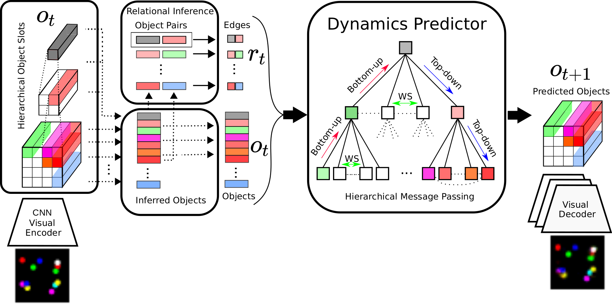
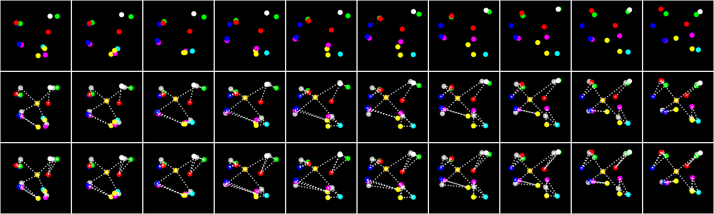

# Hierarchical Relational Inference (HRI)

This is the code repository for the ["Hierarchical Relational Inference"](https://arxiv.org/pdf/2010.03635.pdf) paper.



## Datasets

Generator scripts for the synthetic dataset simulation environments are provided.

To generate the data run the following script in the `data` directory:
```
01_script_generate_dataset.sh     # generates 4-3-springs and 3-3-springs
```
Video datasets can be quite large. If you are running several short experiments, it might be useful to load the data into RAM via SharedArray. Note that this is *optional* and not a prerequisite to run the experiments.

For this run the following script in the `data` directory:

```
02_script_load_data_to_RAM.sh     # load the data into RAM memory (easier to train/evaluate multiple models - load data only once)
```
Once you finish experimenting and want to remove the data from RAM simply run the following script in the `data` directory:

```
03_script_delete_data_from_RAM.sh # remove data from RAM (after training/evluation are complete)
```


## Dependencies
All dependencies are listed in the `requirements.txt` file.

## Experiments - State Springs Datasets



Note: If you prefer not to load the dataset into RAM, just append `sdata.use_shared_memory=False` flag to any training or evaluation command you run.


Following are specific commands used for training all models, ablations and baselines for the 4-3-state-springs dataset.

For other datasets (e.g. 3-3-state-springs dataset) use the same commands, only replace `sdata.name=HspringsV2_4-3_17_04_32_0.04` with `sdata.name=HspringsV2_3-3_13_04_32_0.04`.

HRI
```
python hri/experiment.py with smodel.n_slot_dims=None sdata.name=HspringsV2_4-3_17_04_32_0.04 smodel.enc_t2r.type=nri smodel.dyn_t2t.type=nri_lstm smodel.dyn_t2t.adj_mat=t2r_nri smodel.dyn_t2t.HRI=True
```
NRI
```
python hri/experiment.py with smodel.n_slot_dims=None sdata.name=HspringsV2_4-3_17_04_32_0.04 smodel.enc_t2r.type=nri smodel.dyn_t2t.type=nri_lstm smodel.dyn_t2t.adj_mat=t2r_nri
```
NRI-lo
```
python hri/experiment.py with smodel.n_slot_dims=None sdata.name=HspringsV2_4-3_17_04_32_0.04 smodel.enc_t2r.type=nri smodel.dyn_t2t.type=nri_lstm smodel.dyn_t2t.adj_mat=t2r_nri smodel.dyn_t2t.last_level=True
```
FCMP
```
python hri/experiment.py with smodel.n_slot_dims=None sdata.name=HspringsV2_4-3_17_04_32_0.04 smodel.dyn_t2t.type=nri_lstm smodel.dyn_t2t.adj_mat=full
```
HRI-H
```
python hri/experiment.py with smodel.n_slot_dims=None sdata.name=HspringsV2_4-3_17_04_32_0.04 smodel.enc_t2r.type=nri smodel.dyn_t2t.type=nri_lstm smodel.dyn_t2t.adj_mat=t2r_nri_H smodel.dyn_t2t.HRI=True
```
NRI-GT
```
python hri/experiment.py with smodel.n_slot_dims=None sdata.name=HspringsV2_4-3_17_04_32_0.04 smodel.dyn_t2t.type=nri_lstm smodel.dyn_t2t.adj_mat=gt
```
HRI-GT
```
python hri/experiment.py with smodel.n_slot_dims=None sdata.name=HspringsV2_4-3_17_04_32_0.04 smodel.dyn_t2t.type=nri_lstm smodel.dyn_t2t.adj_mat=gt smodel.dyn_t2t.HRI=True
```
LSTM
```
python hri/experiment.py with smodel.n_slot_dims=None sdata.name=HspringsV2_4-3_17_04_32_0.04 smodel.dyn_t2t.type=lstm smodel.dyn_t2t.adj_mat=full
```
LSTM-lo
```
python hri/experiment.py with smodel.n_slot_dims=None sdata.name=HspringsV2_4-3_17_04_32_0.04 smodel.dyn_t2t.type=lstm smodel.dyn_t2t.adj_mat=full smodel.dyn_t2t.last_level=True
```

## Experiments - Visual Springs Datasets

Following are specific commands used for training all models, ablations and baselines for the 4-3-visual-springs dataset, for both SlotDec and ParDec variants.

For 3-3-visual-springs (both SlotDec and ParDec) simply replace `sdata.name=HspringsV2_4-3_17_04_32_0.04` with `sdata.name=HspringsV2_3-3_13_04_32_0.04`.

To train and evaluate models on the black-and-white springs dataset append an argument `sdata.bw=True` to any of the above commands.

### SlotDec - pretraining the encoder and decoder (on reconstruction task)


```
python hri/experiment.py with smodel.enc_i2t.type=i2t_t2h smodel.enc_i2t.i2t_type=slot_conv smodel.dec_t2i.type=slot_conv sdata.name=HspringsV2_4-3_17_05_32_0.04
```

### SlotDec - starting from a pretrained encoder and decoder

HRI
```
python hri/experiment.py with smodel.par_to_opt=dyn smodel.enc_i2t.type=i2t_t2h smodel.enc_i2t.i2t_type=slot_conv smodel.enc_i2t.t2h_type=conv smodel.dec_t2i.type=slot_conv sdata.name=HspringsV2_4-3_17_04_32_0.04 smodel.enc_i2t.load_path='models/4-3_04_slot' smodel.dec_t2i.load_path='models/4-3_04_slot' smodel.enc_t2r.type=nri smodel.dyn_t2t.type=nri_lstm smodel.dyn_t2t.adj_mat=t2r_nri smodel.dyn_t2t.HRI=True
```
NRI
```
python hri/experiment.py with smodel.par_to_opt=dyn smodel.enc_i2t.type=i2t_t2h smodel.enc_i2t.i2t_type=slot_conv smodel.enc_i2t.t2h_type=conv smodel.dec_t2i.type=slot_conv sdata.name=HspringsV2_4-3_17_04_32_0.04 smodel.enc_i2t.load_path='models/4-3_04_slot' smodel.dec_t2i.load_path='models/4-3_04_slot' smodel.enc_t2r.type=nri smodel.dyn_t2t.type=nri_lstm smodel.dyn_t2t.adj_mat=t2r_nri
```
NRI-lo
```
python hri/experiment.py with smodel.par_to_opt=dyn smodel.enc_i2t.type=i2t_t2h smodel.enc_i2t.i2t_type=slot_conv smodel.enc_i2t.t2h_type=conv smodel.dec_t2i.type=slot_conv sdata.name=HspringsV2_4-3_17_04_32_0.04 smodel.enc_i2t.load_path='models/4-3_04_slot' smodel.dec_t2i.load_path='models/4-3_04_slot' smodel.enc_t2r.type=nri smodel.dyn_t2t.type=nri_lstm smodel.dyn_t2t.adj_mat=t2r_nri smodel.dyn_t2t.last_level=True
```
FCMP
```
python hri/experiment.py with smodel.par_to_opt=dyn smodel.enc_i2t.type=i2t_t2h smodel.enc_i2t.i2t_type=slot_conv smodel.enc_i2t.t2h_type=conv smodel.dec_t2i.type=slot_conv sdata.name=HspringsV2_4-3_17_04_32_0.04 smodel.enc_i2t.load_path='models/4-3_04_slot' smodel.dec_t2i.load_path='models/4-3_04_slot' smodel.dyn_t2t.type=nri_lstm smodel.dyn_t2t.adj_mat=full
```
LSTM
```
python hri/experiment.py with smodel.par_to_opt=dyn smodel.enc_i2t.type=i2t_t2h smodel.enc_i2t.i2t_type=slot_conv smodel.enc_i2t.t2h_type=conv smodel.dec_t2i.type=slot_conv sdata.name=HspringsV2_4-3_17_04_32_0.04 smodel.enc_i2t.load_path='models/4-3_04_slot' smodel.dec_t2i.load_path='models/4-3_04_slot' smodel.dyn_t2t.type=lstm smodel.dyn_t2t.adj_mat=full
```
LSTM-lo
```
python hri/experiment.py with smodel.par_to_opt=dyn smodel.enc_i2t.type=i2t_t2h smodel.enc_i2t.i2t_type=slot_conv smodel.enc_i2t.t2h_type=conv smodel.dec_t2i.type=slot_conv sdata.name=HspringsV2_4-3_17_04_32_0.04 smodel.enc_i2t.load_path='models/4-3_04_slot' smodel.dec_t2i.load_path='models/4-3_04_slot' smodel.dyn_t2t.type=lstm smodel.dyn_t2t.adj_mat=full smodel.dyn_t2t.last_level=True
```

### ParDec - pretraining the encoder and decoder (on reconstruction task)

```
python hri/experiment.py with smodel.enc_i2t.type=i2t_t2h smodel.enc_i2t.i2t_type=conv smodel.dec_t2i.type=par_conv smodel.dec_t2i.in_map=none sdata.name=HspringsV2_4-3_17_04_32_0.04
```

### ParDec - starting from a pretrained encoder and decoder
HRI
```
python hri/experiment.py with smodel.par_to_opt=dyn smodel.enc_i2t.type=i2t_t2h smodel.enc_i2t.i2t_type=conv smodel.enc_i2t.t2h_type=conv smodel.dec_t2i.type=par_conv smodel.dec_t2i.in_map=none sdata.name=HspringsV2_4-3_17_04_32_0.04 smodel.enc_i2t.load_path='models/4-3_04_par' smodel.dec_t2i.load_path='models/4-3_04_par' smodel.enc_t2r.type=nri smodel.dyn_t2t.type=nri_lstm smodel.dyn_t2t.adj_mat=t2r_nri smodel.dyn_t2t.HRI=True
```
NRI
```
python hri/experiment.py with smodel.par_to_opt=dyn smodel.enc_i2t.type=i2t_t2h smodel.enc_i2t.i2t_type=conv smodel.enc_i2t.t2h_type=conv smodel.dec_t2i.type=par_conv smodel.dec_t2i.in_map=none sdata.name=HspringsV2_4-3_17_04_32_0.04 smodel.enc_i2t.load_path='models/4-3_04_par' smodel.dec_t2i.load_path='models/4-3_04_par' smodel.enc_t2r.type=nri smodel.dyn_t2t.type=nri_lstm smodel.dyn_t2t.adj_mat=t2r_nri
```
NRI-lo
```
python hri/experiment.py with smodel.par_to_opt=dyn smodel.enc_i2t.type=i2t_t2h smodel.enc_i2t.i2t_type=conv smodel.enc_i2t.t2h_type=conv smodel.dec_t2i.type=par_conv smodel.dec_t2i.in_map=none sdata.name=HspringsV2_4-3_17_04_32_0.04 smodel.enc_i2t.load_path='models/4-3_04_par' smodel.dec_t2i.load_path='models/4-3_04_par' smodel.enc_t2r.type=nri smodel.dyn_t2t.type=nri_lstm smodel.dyn_t2t.adj_mat=t2r_nri smodel.dyn_t2t.last_level=True
```
FCMP
```
python hri/experiment.py with smodel.par_to_opt=dyn smodel.enc_i2t.type=i2t_t2h smodel.enc_i2t.i2t_type=conv smodel.enc_i2t.t2h_type=conv smodel.dec_t2i.type=par_conv smodel.dec_t2i.in_map=none sdata.name=HspringsV2_4-3_17_04_32_0.04 smodel.enc_i2t.load_path='models/4-3_04_par' smodel.dec_t2i.load_path='models/4-3_04_par' smodel.dyn_t2t.type=nri_lstm smodel.dyn_t2t.adj_mat=full
```
LSTM
```
python hri/experiment.py with smodel.par_to_opt=dyn smodel.enc_i2t.type=i2t_t2h smodel.enc_i2t.i2t_type=conv smodel.enc_i2t.t2h_type=conv smodel.dec_t2i.type=par_conv smodel.dec_t2i.in_map=none sdata.name=HspringsV2_4-3_17_04_32_0.04 smodel.enc_i2t.load_path='models/4-3_04_par' smodel.dec_t2i.load_path='models/4-3_04_par' smodel.dyn_t2t.type=lstm smodel.dyn_t2t.adj_mat=full
```
LSTM-lo
```
python hri/experiment.py with smodel.par_to_opt=dyn smodel.enc_i2t.type=i2t_t2h smodel.enc_i2t.i2t_type=conv smodel.enc_i2t.t2h_type=conv smodel.dec_t2i.type=par_conv smodel.dec_t2i.in_map=none sdata.name=HspringsV2_4-3_17_04_32_0.04 smodel.enc_i2t.load_path='models/4-3_04_par' smodel.dec_t2i.load_path='models/4-3_04_par' smodel.dyn_t2t.type=lstm smodel.dyn_t2t.adj_mat=full smodel.dyn_t2t.last_level=True
```


## Evaluation code

To evaluate a pretrained model use `evaluate_only=True` and `resume_dir=..` flags.

For example, if you train a model with the following command:
```
python hri/experiment.py with smodel.n_slot_dims=None sdata.name=HspringsV2_4-3_17_04_32_0.04 smodel.enc_t2r.type=nri smodel.dyn_t2t.type=nri_lstm smodel.dyn_t2t.adj_mat=t2r_nri smodel.dyn_t2t.HRI=True
```
and the results (and model checkpoints) are logged in directory called `results/2020-09-27T18:06:11.778939` you should evaluate it with:
```
python hri/experiment.py with smodel.n_slot_dims=None sdata.name=HspringsV2_4-3_17_04_32_0.04 smodel.enc_t2r.type=nri smodel.dyn_t2t.type=nri_lstm smodel.dyn_t2t.adj_mat=t2r_nri smodel.dyn_t2t.HRI=True evaluate_only=True resume_dir='results/2020-05-27T18:06:11.778939'
```


## Pre-trained models

Pretrained visual encoder and decoder modules are provided in the `models` directory.

